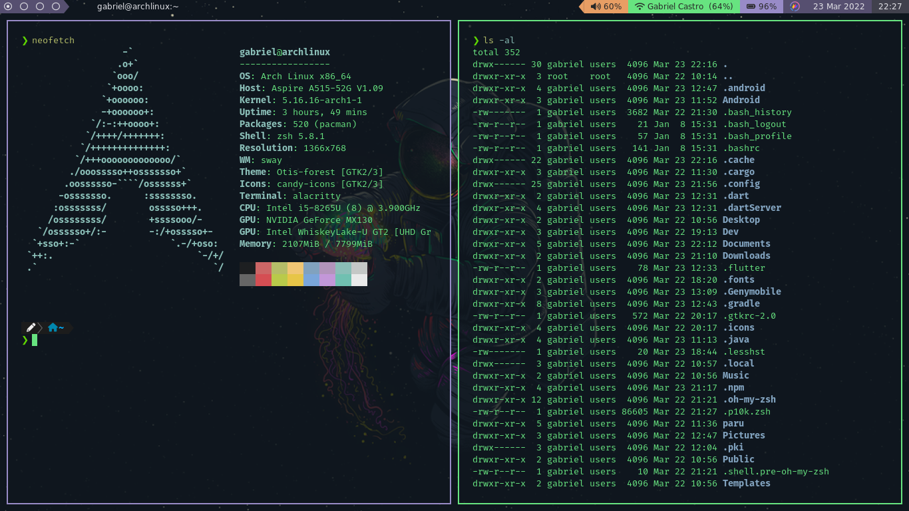

# MyOmni Style

Estes são os meus arquivos de configuração do SwayWM

	
	
	

## Instalado
 - Sway
 - Waybar
 - Wofi
 - Alacritty

> Instale apenas o que é necessário para você e os arquivos necessários, para não ter nenhum tipo de conflito

## Para usar

Realize o download dos arquivos neste repositório e substitua por os seus no diretório /home/username/.config/...

> Para o wallpaper, recomendo criar um diretório chamado Wallpapers dentro do diretório Pictures. No config do Sway já tenho configurado este caminho para o wallpaper.
